# GoodLeads MCP server

[](https://registry.modelcontextprotocol.io/v0.1/servers?search=goodleads)
[](https://glama.ai/mcp/connectors/club.goodleads/new-business-owner-contacts)
[](LICENSE)

GoodLeads sells the owner of a newly formed US business — by name, with a mailing address and, where verified, a phone or email. Every record starts as the state's own formation filing, read from the public registry, and is on the list the morning after the state posts it — before it turns up in any commercial sales database. Six states are live today, adding about 5,000 new filings a day on average. The contact is the owner or an officer named on the filing, never the attorney or formation service that filed it. Priced per record, quoted live, no minimums; hard bounce, disconnected phone or wrong person replaced within 30 days.

The server is **remote and keyless**. There is nothing to install and no code in this repository — it holds the connection notes, the registry listing file and the public facts. The help page with the same steps and a live example is <https://app.goodleads.club/connect.html>.

**The door (the GoodLeads MCP server):**

```
https://mcp.goodleads.club/mcp
```

The door is the address your agent connects to, not a web page. No key, no account, no OAuth — paste it wherever your client asks for a remote MCP server; if it asks for a connection type, pick **Streamable HTTP**. The door is stateless — no session header needed. Nothing is charged until you complete checkout — the count and the price come first.

## Connect in 30 seconds

**First thing to say, once it is on:**

> Find me 50 new businesses in Denver I can call this week and quote both the callable-now and newest mail-first options.

### Claude (claude.ai and Claude Desktop)

1. Open [Customize → Connectors](https://claude.ai/customize/connectors).
2. Click **+**, then **Add custom connector**.
3. Paste `https://mcp.goodleads.club/mcp` as the remote MCP server URL. Leave Advanced settings (OAuth) empty — the door needs none.
4. Click **Add**.
5. In a chat, open **+** (lower left) → **Connectors** and switch GoodLeads on.

Team and Enterprise: an Owner adds it under Organization settings → Connectors → Add → Custom → Web. Members then find it under Customize → Connectors and click Connect. Custom connectors work on Free (one connector), Pro, Max, Team and Enterprise, and in Claude Desktop.

Claude Code, one line:

```bash
claude mcp add --transport http goodleads https://mcp.goodleads.club/mcp
```

### ChatGPT

1. Turn on Developer mode: **Settings → Apps → Advanced settings → Developer mode**. (Business and Enterprise workspaces: an admin first allows *Create custom MCP connectors* under Workspace Settings → Permissions & Roles → Connected Data.)
2. Open **Settings → Connectors** and click **Create**.
3. Name: `GoodLeads`. Description: *Reach the owner of a newly formed business the morning after the state posts it. Count, price, buy.* MCP server URL: `https://mcp.goodleads.club/mcp`. Authentication: **No authentication** — there is no login; reading is free and you identify yourself only when you pay.
4. Create it, then enable it in a chat from the apps menu.

### Cursor

[](cursor://anysphere.cursor-deeplink/mcp/install?name=goodleads&config=eyJ1cmwiOiJodHRwczovL21jcC5nb29kbGVhZHMuY2x1Yi9tY3AifQ==)

If the button does nothing, [open the install link on cursor.com](https://cursor.com/install-mcp?name=goodleads&config=eyJ1cmwiOiJodHRwczovL21jcC5nb29kbGVhZHMuY2x1Yi9tY3AifQ==). Cursor opens and shows the server; confirm **Install**.

Or by hand: Cursor Settings → Tools & MCP → New MCP server, and add this to `mcp.json`:

```json
{
  "mcpServers": {
    "goodleads": { "url": "https://mcp.goodleads.club/mcp" }
  }
}
```

### VS Code (Copilot agent mode)

From a terminal:

```bash
code --add-mcp '{"name":"goodleads","type":"http","url":"https://mcp.goodleads.club/mcp"}'
```

Or add it to `.vscode/mcp.json` in your workspace (or your user profile's `mcp.json`):

```json
{
  "servers": {
    "goodleads": { "type": "http", "url": "https://mcp.goodleads.club/mcp" }
  }
}
```

### Perplexity (Pro and Max)

1. Open **Account settings → All settings → Connectors**, then **+ Custom connector → Remote**.
2. Name: `GoodLeads`. MCP Server URL: `https://mcp.goodleads.club/mcp`. Under Advanced settings: Authentication **None**, Transport **Streamable HTTP**.
3. Click **Add**, then click the GoodLeads card in Connectors to enable it.

Perplexity notes that it cannot verify third-party MCP servers; every GoodLeads record names the state filing it came from, one call away.

### Gemini (Spark)

1. At [gemini.google.com](https://gemini.google.com), open **Settings & help → Connected Apps**.
2. Under **Custom apps for Spark**, click **Add a custom app**.
3. Paste `https://mcp.goodleads.club/mcp` as the MCP server URL and click **Next**; no credentials are needed.

Requirements (Google's, for any custom app): access to Gemini Spark, a personal Google Account (not a work or school account), 18 or over, in the US, with Keep Activity on. Adding a custom app is done in the web app; Spark itself runs in the web and mobile apps. Work and school accounts (Gemini Enterprise) register MCP servers through an admin and require OAuth — the GoodLeads door is keyless, so it cannot be added there today.

### Cline (VS Code)

In the **MCP Servers** panel open the **Remote Servers** tab, name it `goodleads`, paste `https://mcp.goodleads.club/mcp`, pick **Streamable HTTP**, and add it. Or click **Configure MCP Servers** and add this to `mcpServers`:

```json
{
  "mcpServers": {
    "goodleads": { "type": "streamableHttp", "url": "https://mcp.goodleads.club/mcp" }
  }
}
```

No headers, no token — the door is keyless.

### Grok (grok.com)

Open [grok.com/connectors](https://grok.com/connectors) → **New Connector → Custom**. Paste the door URL; leave authentication empty (there is none) → **Save**.

Instructions checked 2026-09-07 against each app's current menus; if yours differs, the door URL is all you need.

## What you can do

Thirteen tools. Eleven read; two make a payment link. Creating a link costs nothing and charges nobody — payment only happens if a person opens the link and completes checkout.

**Read (free, no key)**

| Tool | What it does |
|---|---|
| `describe_surface` | Describe GoodLeads — what you get and how to act on it |
| `list_live_states` | Live states — the state codes, read live |
| `list_filterable_fields` | Filterable fields and grammar — the filter contract |
| `explain_concept` | Explain a concept — map your word to this surface's fields |
| `interpret_list` | Interpret a list request — the buyer's own words become a list to count and price |
| `quote_list` | Quote a list — how many records name a person, and the price by grade |
| `browse_leads` | Browse leads — rows, or counts and price, for a shape or a saved list |
| `find_lead_by_glid` | Look up one lead by ID |
| `list_starters` | Starter lists — every live state × business type, with live counts |
| `list_products` | Shelf products — ready-made business type × state lists |
| `data_quality_scorecard` | Data quality scorecard — numbers, not adjectives |

**Write (a payment link, nothing charged)**

| Tool | What it does |
|---|---|
| `checkout_list` | Checkout link for a list — a quoted list becomes a payment link a person completes |
| `create_checkout` | Checkout link for a product or list |

Reading is free and needs no key: real records, with names, phones and emails masked. The buying path is `interpret_list` → `quote_list` → `browse_leads` (three masked rows to show the buyer) → `checkout_list`.



## Prices

Name and address $0.25 per record · plus one verified phone or email $0.50 · plus both $0.70 (price rule v1; live prices always come from the summary call's `prices` block).

Only records that name a person are billed. No minimums. Your agent sees the live quote before anyone pays. Open [the sample file](https://app.goodleads.club/api/v1/commerce/sample-file?format=xlsx) — the exact workbook, ten made-up records, every column — before you pay.

## Verify it yourself

The door is stateless, so two plain requests are enough:

```bash
curl -s -X POST https://mcp.goodleads.club/mcp \
  -H 'Content-Type: application/json' \
  -H 'Accept: application/json, text/event-stream' \
  -d '{"jsonrpc":"2.0","id":1,"method":"initialize","params":{"protocolVersion":"2025-06-18","capabilities":{},"clientInfo":{"name":"curl","version":"0"}}}'
```

```bash
curl -s -X POST https://mcp.goodleads.club/mcp \
  -H 'Content-Type: application/json' \
  -H 'Accept: application/json, text/event-stream' \
  -d '{"jsonrpc":"2.0","id":2,"method":"tools/list"}'
```

The first returns `serverInfo` (`goodleads` and the running version); the second lists the thirteen tools above with their input schemas.

## The registry listing

[`server.json`](server.json) is the file published to the official MCP Registry under the name `club.goodleads/new-business-owner-contacts`. The registry entry is the source of truth; the copy here is for reading. Check the live one:

```bash
curl -s 'https://registry.modelcontextprotocol.io/v0.1/servers?search=goodleads'
```

Agent quick start, in one file: <https://app.goodleads.club/llms.txt>.

## Data, privacy, terms, support

- Privacy: <https://goodleads.club/privacy.html>
- Terms: <https://goodleads.club/terms.html>
- Support: <goproductmgt@gmail.com> — or [open an issue](https://github.com/Goproductmgt/goodleads-mcp/issues/new/choose) here
- Help page: <https://app.goodleads.club/connect.html>

Every record starts as the state's own formation filing, read from the public registry, with the owner matched to it as a person — not the attorney or formation service who filed the paperwork. Every read carries provenance, so any record can be checked against the state.

## License

The documents in this repository are licensed [CC BY 4.0](LICENSE). There is no code here; the server itself is a hosted service under the [terms](https://goodleads.club/terms.html) above.
